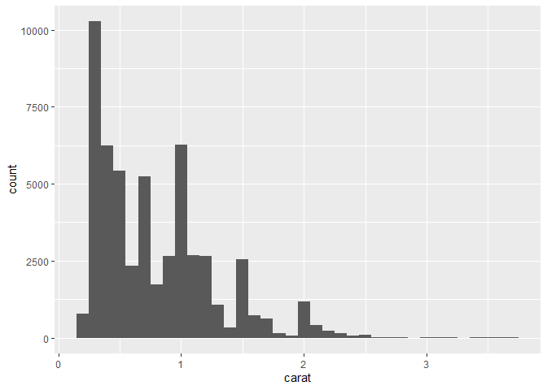
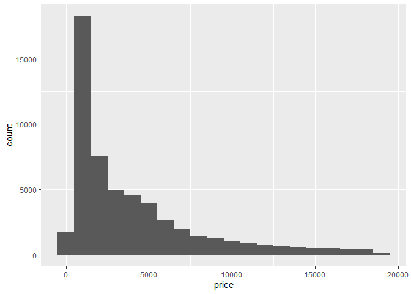

diamonds데이터 분석하기
================
김 다 영
August 11, 2020

# 다이아몬드 데이터

## 데이터 분석 준비하기

### 1\. 데이터 준비하기

  - price : 미국 달러 가격
  - carat : 다이아몬드의 무게
  - cut : 5단계의 다이아몬드 컷팅 퀄리티(Fair, Good, Very Good, Premium, Ideal)
  - color : 다이아몬드의 색(D(best)부터 J(worst)까지)
  - clarity : clear한 정도 (I1 (worst), SI2, SI1, VS2, VS1, VVS2, VVS1, IF
    (best))

<!-- end list -->

``` r
View(diamonds)
summary(diamonds) #요약통계량 출력
```

## 데이터 파악하기

### 1\. 분포 시각화

#### 1\. 범주형 변수

  - 변수가 범주형인지 연속형인지에 따라 시각화하는 방법이 다르다.
  - 범주형 변수인 cut의 분포를 확인하기 위해서는 막대그래프를 사용한다.

<!-- end list -->

``` r
table(diamonds$cut)
```

    ## 
    ##      Fair      Good Very Good   Premium     Ideal 
    ##      1610      4906     12082     13791     21551

``` r
diamonds %>% count(cut)
```

    ## # A tibble: 5 x 2
    ##   cut           n
    ##   <ord>     <int>
    ## 1 Fair       1610
    ## 2 Good       4906
    ## 3 Very Good 12082
    ## 4 Premium   13791
    ## 5 Ideal     21551

``` r
ggplot(data = diamonds) + geom_bar(mapping = aes(x=cut))
```

<!-- -->

cut의 정도에 따라 Fair한 경우는 1610, ideal는 21551로 나타난다.

#### 2\. 연속형 변수

#### carat

``` r
summary(diamonds$carat)
```

    ##    Min. 1st Qu.  Median    Mean 3rd Qu.    Max. 
    ##  0.2000  0.4000  0.7000  0.7979  1.0400  5.0100

  - 연속형 변수인 carat의 분포를 확인하기 위해서는 히스토그램을 사용한다.
  - ’carat’의 수치를 일정한 간격(0.5)으로 나누어 분포를 확인한다.

<!-- end list -->

``` r
diamonds %>% count(cut_width(carat, 0.5))
```

    ## # A tibble: 11 x 2
    ##    `cut_width(carat, 0.5)`     n
    ##    <fct>                   <int>
    ##  1 [-0.25,0.25]              785
    ##  2 (0.25,0.75]             29498
    ##  3 (0.75,1.25]             15977
    ##  4 (1.25,1.75]              5313
    ##  5 (1.75,2.25]              2002
    ##  6 (2.25,2.75]               322
    ##  7 (2.75,3.25]                32
    ##  8 (3.25,3.75]                 5
    ##  9 (3.75,4.25]                 4
    ## 10 (4.25,4.75]                 1
    ## 11 (4.75,5.25]                 1

``` r
ggplot(data = diamonds) + geom_histogram(mapping = aes(x=carat),binwidth = 0.5)
```

<!-- -->

  - 간격을 다양하게 줄여 분포 형태를 더 상세하게 볼 수 있다.

<!-- end list -->

``` r
smaller <- diamonds %>% filter(carat<4)
ggplot(data = smaller) + geom_histogram(mapping = aes(x=carat),binwidth = 0.1)
```

<!-- -->

#### price

``` r
summary(diamonds$price)
```

    ##    Min. 1st Qu.  Median    Mean 3rd Qu.    Max. 
    ##     326     950    2401    3933    5324   18823

  - 다이아몬드의 ’price’는 최소값이 326달러, 최댓값은 18823달러이다.
  - 1000달러 미만은 1, 1000불-5000불은 2, 5000불 이상은 3으로 변형하여 데이터 분포를 살펴보자.

<!-- end list -->

``` r
diamonds$PriceGroup =  ifelse (diamonds$price<1000,1,
                               ifelse(diamonds$price<5000,2,3))
table(diamonds$PriceGroup)
```

    ## 
    ##     1     2     3 
    ## 14499 24714 14727

``` r
diamonds %>% count(cut_width(price, 1000))
```

    ## # A tibble: 20 x 2
    ##    `cut_width(price, 1000)`     n
    ##    <fct>                    <int>
    ##  1 [-500,500]                1749
    ##  2 (500,1.5e+03]            18261
    ##  3 (1.5e+03,2.5e+03]         7532
    ##  4 (2.5e+03,3.5e+03]         4958
    ##  5 (3.5e+03,4.5e+03]         4535
    ##  6 (4.5e+03,5.5e+03]         3950
    ##  7 (5.5e+03,6.5e+03]         2627
    ##  8 (6.5e+03,7.5e+03]         1946
    ##  9 (7.5e+03,8.5e+03]         1395
    ## 10 (8.5e+03,9.5e+03]         1253
    ## 11 (9.5e+03,1.05e+04]        1000
    ## 12 (1.05e+04,1.15e+04]        899
    ## 13 (1.15e+04,1.25e+04]        721
    ## 14 (1.25e+04,1.35e+04]        655
    ## 15 (1.35e+04,1.45e+04]        576
    ## 16 (1.45e+04,1.55e+04]        482
    ## 17 (1.55e+04,1.65e+04]        471
    ## 18 (1.65e+04,1.75e+04]        437
    ## 19 (1.75e+04,1.85e+04]        391
    ## 20 (1.85e+04,1.95e+04]        102

``` r
ggplot(data = diamonds) + geom_histogram(mapping = aes(x=price),binwidth = 1000)
```

<!-- -->
