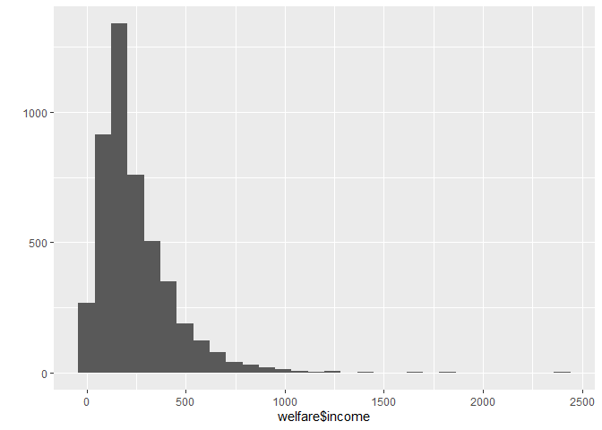

성별에 따라 월급이 다를까?
================
김다영
July 30, 2020

## 2\. 성별에 따른 월급 차이

과거에 비해 여성들이 활발하게 사회 진출을 한다. 하지만 직장에서 받는 대우는 여전히 차별이 존재한다. 데이터 분석을 통해 성별에
따라 월급 차이가 있는지 알아보자.

### 분석 절차

분석절차는 다음과 같다. 1단계: 변수 검토 및 전처리 (성별 & 월급), 2단계:변수 간 관계 분석 (성별 월급 평균표 만들기
& 그래프 만들기)

### 성별 변수 검토 및 전처리

#### 1\. 변수 검토하기

``` r
class(welfare$sex)
table(welfare$sex)
```

#### 2\. 전처리

1은 남자, 2는 여자를 의미하고 미응답시 9로 코딩된다(코드북 참조). 값이 9인 경우와 이상치는 NA로 처리한다.

``` r
#이상치확인
table(welfare$sex)
```

    ## 
    ##    1    2 
    ## 7578 9086

``` r
# 이상치 결측 처리
welfare$sex <-ifelse(welfare$sex == 9,NA, welfare$sex)

#결측치 확인 
table(is.na(welfare$sex))
```

    ## 
    ## FALSE 
    ## 16664

``` r
#성별 항목 이름 부여
welfare$sex <-ifelse(welfare$sex ==1, "male", "female")
table(welfare$sex)
```

    ## 
    ## female   male 
    ##   9086   7578

``` r
qplot(welfare$sex)
```

<!-- -->

### 월급 변수 검토 및 전처리

#### 1\. 변수 검토하기

income 변수를 검토하고 qplot으로 분포를 확인하고,성별 변수는 범주 변수이므로 table로 특징을 파악한다. 연속 변수인
income은 summary로 특징을 파악한다.

``` r
class(welfare$income)
```

    ## [1] "numeric"

``` r
summary(welfare$income)
```

    ##    Min. 1st Qu.  Median    Mean 3rd Qu.    Max.    NA's 
    ##     0.0   122.0   192.5   241.6   316.6  2400.0   12030

``` r
qplot(welfare$income)
```

<!-- -->

``` r
#0~1000
qplot(welfare$income) + xlim(0,1000)
```

<!-- --> \#\#\#\#
2. 전처리 1\~9998: 월급, 9999: 무응답/모름

``` r
#이상치 확인
summary(welfare$income)
```

    ##    Min. 1st Qu.  Median    Mean 3rd Qu.    Max.    NA's 
    ##     0.0   122.0   192.5   241.6   316.6  2400.0   12030

``` r
#이상치 결측 처리
welfare$income <-ifelse(welfare$income %in% c (0,9999),NA, welfare$income)

#결측치 확인
table(is.na(welfare$income))
```

    ## 
    ## FALSE  TRUE 
    ##  4620 12044

### 성별에 따른 월급 차이 분석하기

#### 1\. 성별 월급 평균표 만들기

``` r
sex_income<-welfare %>% 
  filter(!is.na(income)) %>% 
  group_by(sex) %>% 
  summarise(mean_income =mean(income))
```

    ## `summarise()` ungrouping output (override with `.groups` argument)

``` r
sex_income
```

    ## # A tibble: 2 x 2
    ##   sex    mean_income
    ##   <chr>        <dbl>
    ## 1 female        163.
    ## 2 male          312.

#### 2\. 그래프 만들기

``` r
ggplot(data = sex_income, aes(x=sex, y=mean_income)) + geom_col()
```

<!-- -->
