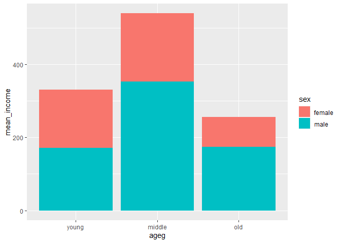
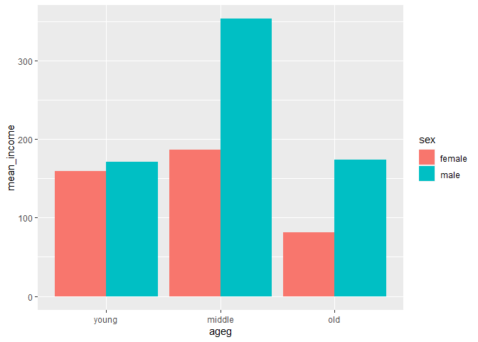

성별 월급 차이는 연령대별로 다를까?
================
김 다 영
July 31, 2020

## 5\. 연령대 및 성별 월급 차이

성별 월급 차이가 연령대에 따라 다른지 분석해 보자\!

### 분석 절차

### 연령대 및 성별 월급 차이 분석하기

#### 1\. 연령대 및 성별 월급 평균표 만들기

``` r
sex_income <- welfare %>%  
  filter(!is.na(income)) %>% 
  group_by(ageg,sex) %>% 
  summarise(mean_income = mean(income))

sex_income
```

#### 2\. 그래프 만들기

``` r
ggplot(data = sex_income, aes(x = ageg, y = mean_income, fill = sex)) +
  geom_col() +
  scale_x_discrete(limits = c("young","middle","old"))
```

<!-- -->

#### 성별 막대 분리

``` r
ggplot(data = sex_income, aes(x = ageg, y = mean_income, fill = sex)) +
  geom_col(position = "dodge") +
  scale_x_discrete(limits = c("young","middle","old"))
```

<!-- --> 성별 월급 차이의
양상이 연령대별로 다르게 나타난다. 30세 미만에는 차이가 크지 않다가 30세에서 59세 사이에서 차이가 크게 벌어져 남성이
166만원 더 많이 받는다. 60세 이상에서는 차이가 줄어들지만 여전히 남성의 월급이 92만원 더 많다. 연령대별로 월급의 차이는
초년과 노년에서 많았지만. 성별로 나눈 분석 결과에서는 남성의 경우 초년과 노년 간 월급 차이가 크지 않다.

### 나이 및 성별 월급 차이 분석하기

#### 그래프 만들기

``` r
# 성별 연령별 월급 평균표 만들기
sex_age <- welfare %>% 
  filter(!is.na(income)) %>% 
  group_by(age,sex) %>% 
  summarise(mean_income = mean(income))

head(sex_income)

ggplot(data = sex_age, aes(x = age, y = mean_income, col = sex)) + geom_line()
```

<!-- -->
