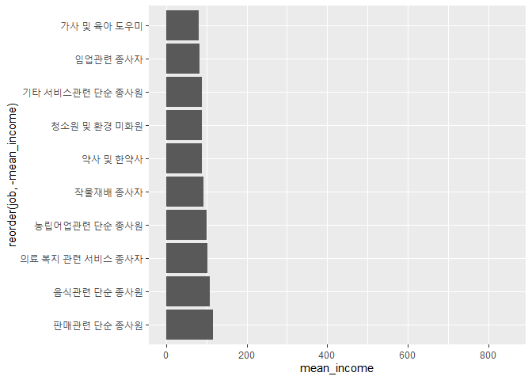

어떤 직업이 월급을 가장 많이 받을까?
================
김 다 영
July 31, 2020

## 6\. 직업별 월급 차이

### 분석 절차

### 직업 변수 검토 및 전처리하기

#### 1\. 변수 검토하기

code\_job 변수는 직업 코드를 의미한다. 이 데이터에서는 직업을 이름이 아닌 직업분류코드로 입력하였다. 따라서
직업분류코드를 이용해 직업 명칭 변수를 만들어보자.

``` r
class(welfare$code_job)
table(welfare$code_job)
```

#### 2\. 전처리

``` r
library(readxl) 
list_job <- read_excel("Koweps_Codebook.xlsx", col_names = T, sheet = 2)

head(list_job)
dim(list_job)
```

직업분류코드 목록이 코드와 직업명 두 변수로 구성되고, 직업이 149개로 분류된다.

``` r
welfare <- left_join(welfare, list_job, id = "code_job")

welfare %>% 
  filter(!is.na(code_job)) %>% 
  select(code_job, job) %>% 
  head(10)
```

    ##    code_job                                job
    ## 1       942                   경비원 및 검표원
    ## 2       762                             전기공
    ## 3       530 방문 노점 및 통신 판매 관련 종사자
    ## 4       999        기타 서비스관련 단순 종사원
    ## 5       312                    경영관련 사무원
    ## 6       254             문리 기술 및 예능 강사
    ## 7       510                        영업 종사자
    ## 8       530 방문 노점 및 통신 판매 관련 종사자
    ## 9       286   스포츠 및 레크레이션 관련 전문가
    ## 10      521                   매장 판매 종사자

### 직업별 월급 차이 분석하기

#### 1\. 직업별 월급 평균표 만들기

``` r
job_income <- welfare %>% 
  filter(!is.na(job) & !is.na(income)) %>% 
  group_by(job) %>% 
  summarise(mean_income = mean(income))

head(job_income, 10)
```

    ## # A tibble: 10 x 2
    ##    job                                mean_income
    ##    <chr>                                    <dbl>
    ##  1 가사 및 육아 도우미                       80.2
    ##  2 간호사                                   241. 
    ##  3 건설 및 광업 단순 종사원                 190. 
    ##  4 건설 및 채굴 기계운전원                  358. 
    ##  5 건설 전기 및 생산 관련 관리자            536. 
    ##  6 건설관련 기능 종사자                     247. 
    ##  7 건설구조관련 기능 종사자                 242. 
    ##  8 건축 및 토목 공학 기술자 및 시험원       378. 
    ##  9 건축마감관련 기능 종사자                 254. 
    ## 10 경비원 및 검표원                         134.

#### 2\. 상위 10개 추출

``` r
top10 <- job_income %>% 
  arrange(desc(mean_income)) %>% 
  head(10)
top10
```

    ## # A tibble: 10 x 2
    ##    job                                  mean_income
    ##    <chr>                                      <dbl>
    ##  1 금속 재료 공학 기술자 및 시험원             845.
    ##  2 의료진료 전문가                             844.
    ##  3 의회의원 고위공무원 및 공공단체임원         750 
    ##  4 보험 및 금융 관리자                         726.
    ##  5 제관원 및 판금원                            572.
    ##  6 행정 및 경영지원 관리자                     564.
    ##  7 문화 예술 디자인 및 영상 관련 관리자        557.
    ##  8 연구 교육 및 법률 관련 관리자               550.
    ##  9 건설 전기 및 생산 관련 관리자               536.
    ## 10 석유 및 화학물 가공장치 조작원              532.

#### 3\. 그래프 만들기

``` r
ggplot(data = top10, aes(x = reorder(job, mean_income),
                         y = mean_income)) +
  geom_col() + 
  coord_flip()
```

<!-- -->

‘금속 재료 공학 기술자 및 시험원’이 평균 월급으로 845만원을 받고, 그 다음으로는 ’의료진료 전문가’, ’의회의원 고위공무원
및 공공단체임원’의 월급이 많다.

#### 4\. 하위 10위 추출

``` r
bottom10 <- job_income %>% 
  arrange(mean_income) %>% 
  head(10)
```

#### 5\. 그래프 만들기

``` r
ggplot(data = bottom10, aes(x = reorder(job, -mean_income), 
                            y = mean_income)) +
  geom_col() + 
  coord_flip() +
  ylim(0, 850)
```

<!-- -->

‘가사 및 육아 도우미’의 월급이 평균 80만원으로 가장 적고, 그 다음으로는 ’임업관련 종사자’, ’기타 서비스 관련 단순
종사원’의 월급이 적었다.
