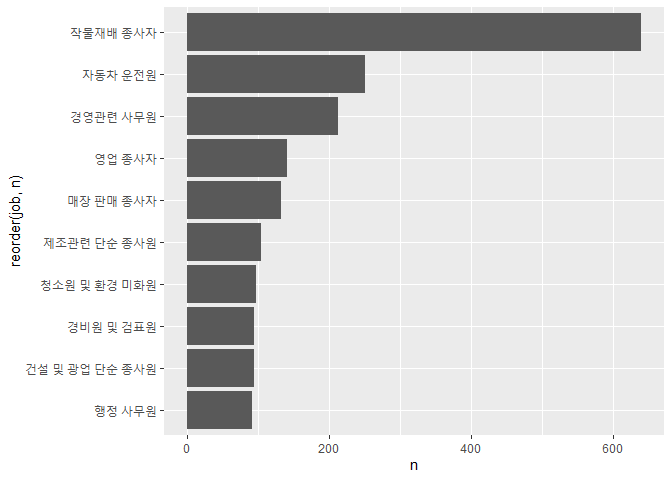

성별로 어떤 직업이 가장 많을까?
================
김 다 영
July 31, 2020

## 7\. 성별 직업 빈도

성 평등이 상식이지만 여전히 성별에 따라 다른 직업을 갖고 있다. 성별에 따라 어떤 직업이 많은지 알아보자\!

### 분석 절차

### 성별 직업 빈도 분석하기

#### 1\. 성별 직업 빈도표 만들기

``` r
#남성 직업 빈도 상위 10개 추출
job_male <- welfare %>% 
  filter(!is.na(job) & sex == "male") %>% 
  group_by(job) %>% 
  summarise(n = n()) %>% 
  arrange(desc(n)) %>% 
  head(10)

job_male
```

    ## # A tibble: 10 x 2
    ##    job                          n
    ##    <chr>                    <int>
    ##  1 작물재배 종사자            640
    ##  2 자동차 운전원              251
    ##  3 경영관련 사무원            213
    ##  4 영업 종사자                141
    ##  5 매장 판매 종사자           132
    ##  6 제조관련 단순 종사원       104
    ##  7 청소원 및 환경 미화원       97
    ##  8 건설 및 광업 단순 종사원    95
    ##  9 경비원 및 검표원            95
    ## 10 행정 사무원                 92

``` r
#여성 직업 빈도 상위 10개 추출
job_female <- welfare %>% 
  filter(!is.na(job) & sex == "female") %>% 
  group_by(job) %>% 
  summarise(n = n()) %>% 
  arrange(desc(n)) %>% 
  head(10)

job_female 
```

    ## # A tibble: 10 x 2
    ##    job                              n
    ##    <chr>                        <int>
    ##  1 작물재배 종사자                680
    ##  2 청소원 및 환경 미화원          228
    ##  3 매장 판매 종사자               221
    ##  4 제조관련 단순 종사원           185
    ##  5 회계 및 경리 사무원            176
    ##  6 음식서비스 종사자              149
    ##  7 주방장 및 조리사               126
    ##  8 가사 및 육아 도우미            125
    ##  9 의료 복지 관련 서비스 종사자   121
    ## 10 음식관련 단순 종사원           104

#### 2\. 그래프 만들기

``` r
#남성 직업 빈도 상위 10개 
ggplot(data = job_male, aes(x = reorder(job,n), y = n)) +
  geom_col() +
  coord_flip()
```

<!-- -->

``` r
#여성 직업 빈도 상위 10개 
ggplot(data = job_female, aes(x = reorder(job,n), y = n)) +
  geom_col() +
  coord_flip()
```

<!-- -->
