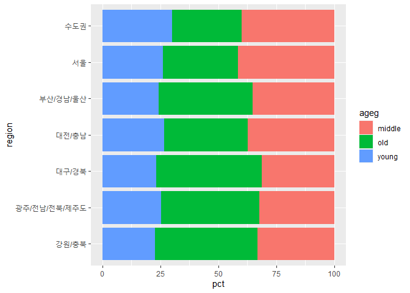
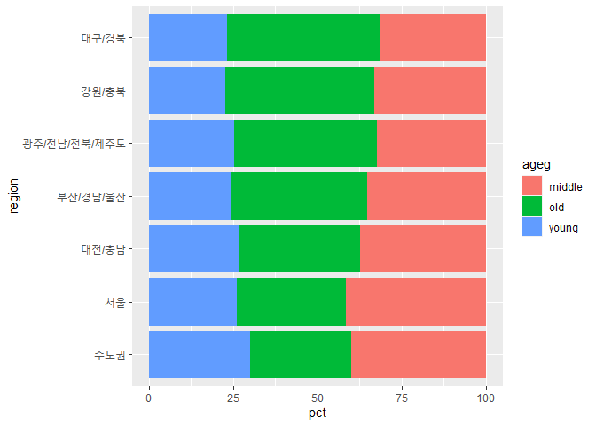
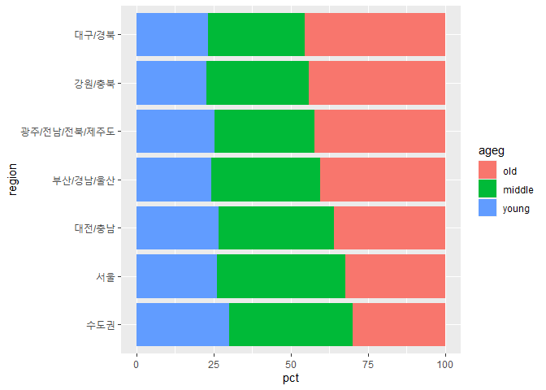

노년층이 많은 지역은 어디일까
================
김 다 영
July 31, 2020

## 9\. 지역별 연령대 비율

고령 사회가 되면서 노인들을 위한 시설을 마련하는 일이 점점 중요해진다. 노인들을 위한 시설을 마련하기 위해서 우선 어느 지역에
노인들이 많이 살고 있는지 알아보자\!

### 분석 절차

### 지역 변수 검토 및 전처리하기

#### 1\. 변수 검토하기

``` r
class(welfare$code_region)
table(welfare$code_region)
```

#### 2\. 전처리

  - 1 : 서울
  - 2 : 수도권(인천/경기)
  - 3 : 부산/경남/울산
  - 4 : 대구/경북
  - 5 : 대전/충남
  - 6 : 강원/충북
  - 7 : 광주/전남/전북/제주도

<!-- end list -->

``` r
#지역 코드 목록 만들기
list_region <- data.frame(code_region = c(1 : 7),
                          region = c("서울",
                                     "수도권",
                                     "부산/경남/울산",
                                     "대구/경북",
                                     "대전/충남",
                                     "강원/충북",
                                     "광주/전남/전북/제주도"))

list_region
```

#### `welfare`에 지역명 변수 추가

``` r
#지역명 변수 추가
welfare <- left_join(welfare, list_region, id ="code_region")
```

    ## Joining, by = "code_region"

``` r
welfare %>% 
  select(code_region, region) %>% 
  head
```

### 지역별 연령대 비율 분석하기

#### 1\. 지역별 연령대 비율표 만들기

``` r
region_ageg <- welfare %>% 
  group_by(region, ageg) %>% 
  summarise(n = n()) %>% 
  mutate(tot_group = sum(n)) %>% 
  mutate(pct = round(n/tot_group *100, 2))

head(region_ageg)
```

#### `count()` 활용

``` r
region_ageg <- welfare %>% 
  count(region, ageg) %>% 
  group_by(region) %>% 
  mutate(pct = round(n/sum(n)*100,2))
```

#### 2\. 그래프 만들기

``` r
ggplot(data =  region_ageg , aes(x = region, y = pct, fill = ageg)) +
  geom_col() +
  coord_flip()
```

<!-- -->

#### 3\. 막대 정렬하기 : 노년층 비율 높은 순

``` r
# 노년층 비율 내림차순 정렬
list_order_old <-region_ageg %>% 
  filter(ageg == "old") %>% 
  arrange(pct)

list_order_old

# 지역명 순서 변수 만들기 
order <- list_order_old$region
order

ggplot(data = region_ageg, aes(x = region, y = pct, fill = ageg)) +
  geom_col() +
  coord_flip() +
  scale_x_discrete(limits = order)
```

<!-- -->

#### 4\. 연령대 순으로 막대 색깔 나열하기

``` r
class(region_ageg$ageg)
```

    ## [1] "character"

``` r
table(region_ageg$ageg)
```

    ## 
    ## middle    old  young 
    ##      7      7      7

``` r
region_ageg$ageg <- factor(region_ageg$ageg,
                           level = c("old", "middle", "young"))
class(region_ageg$ageg)
```

    ## [1] "factor"

``` r
table(region_ageg$ageg)
```

    ## 
    ##    old middle  young 
    ##      7      7      7

``` r
#그래프 생성하기
ggplot(data = region_ageg, aes(x = region, y = pct, fill = ageg)) +
  geom_col() +
  coord_flip() +
  scale_x_discrete(limits = order)
```

<!-- -->
